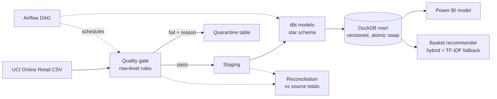

# Feng Jiang

Data and analytics engineer · Christchurch, New Zealand.
I build pipelines that a second person can rerun, audit and take over. Open to data and analytics engineering roles. [Email](mailto:janfinq@gmail.com).

## Start here → [retail-ai-pipeline](https://github.com/Kenchch/retail-ai-pipeline)

**Problem.** Retail invoice exports arrive with cancellations, negative quantities, missing customer IDs and duplicate lines. Revenue and product figures built on the raw file are wrong, and nobody can say by how much.

**What I built.** An Airflow + dbt pipeline that scores every row against explicit quality rules, quarantines the failures with the reason attached, reconciles totals back to the source, and publishes a versioned DuckDB mart that a Power BI model reads from. A hybrid basket-association recommender sits on top of the mart.

**Result.** 541,909 lines processed, 19,343 (3.6%) quarantined with a stated reason, net revenue reconciled to the source. The hybrid recommender beats the most-popular baseline on temporal hit-rate (56.3% vs 52.8% over 161,844 held-out queries). Every number in the README is regenerated by CI.

**Trade-offs I made on purpose.** Airflow, Postgres and Docker Compose are heavier than this dataset needs. I kept them to show scheduling, retries and atomic publication as they would run in production. The [design notes](https://github.com/Kenchch/retail-ai-pipeline/blob/main/docs/DESIGN.md) say what I would remove for a one-off analysis and what I would add before running this for real (monitoring, freshness SLAs, backfill).

[Design notes](https://github.com/Kenchch/retail-ai-pipeline/blob/main/docs/DESIGN.md) · [Run it](https://github.com/Kenchch/retail-ai-pipeline#run-it) · [Tests and CI](https://github.com/Kenchch/retail-ai-pipeline/actions/workflows/ci.yml)

## Other data engineering projects

Each line: the problem, then how it was solved.

- [nz-attraction-pageviews](https://github.com/Kenchch/nz-attraction-pageviews) — A public API drops days and returns partial windows; a naive daily job silently loses data. Incremental Wikimedia ingestion into DuckDB with a watermark, per-venue failure isolation, quarantine of rejected rows, and offline regression tests for every recovery path.
- [online-retail-analysis-r](https://github.com/Kenchch/online-retail-analysis-r) — Same retail data, answered in R + SQL for an analyst audience. Row-level cleaning audit, and verification against a SHA-pinned source so the numbers can be checked, not trusted.
- [nz-sheep-decline-by-region](https://github.com/Kenchch/nz-sheep-decline-by-region) — Stats NZ suppresses small regional cells, so regional series do not add up to the national total. Suppression-aware reconciliation in R + Quarto with a published, CI-rebuilt report.

## Applied ML

- [aerial-small-object-detection](https://github.com/Kenchch/aerial-small-object-detection) — Kept for the measurement discipline rather than the model: YOLO11n on VisDrone2019 with ONNX parity checks and a latency benchmark that separates core inference from transfer time. mAP and latency figures are reported with their limits stated.

## How I work

- **Reproducible by default.** Lockfiles, pinned data sources, CI that rebuilds the reported numbers, and tests that run without network or GPU.
- **AI tools in the loop, decisions on record.** I use Claude Code and Codex to draft code and tests. The architecture, quality rules, reconciliation logic, and the choice of what to measure are mine, and every generated change was reviewed and run before it landed. Each repository's README states which parts were AI-assisted.
- **Archived means archived.** Older PySpark coursework for [Million Song](https://github.com/Kenchch/Million-Song-Dataset-Analysis-with-Spark) and [GHCN-Daily](https://github.com/Kenchch/GHCN-Daily-Climate-Analysis-with-PySpark) is kept because it still reproduces, and each repo says at the top why its Spark pin will not move.

